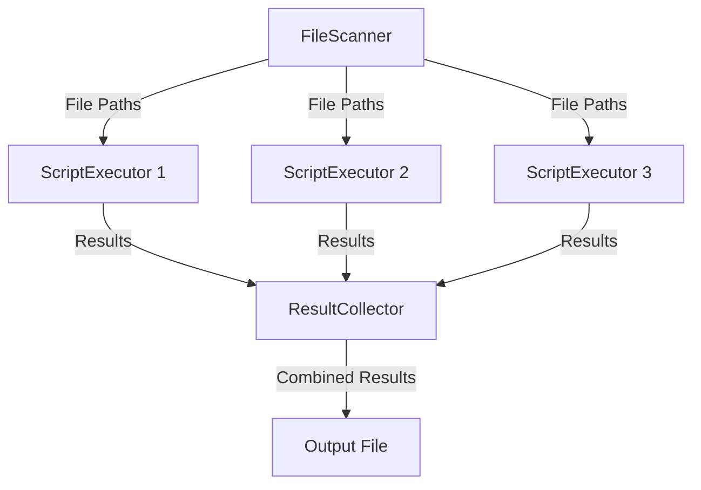
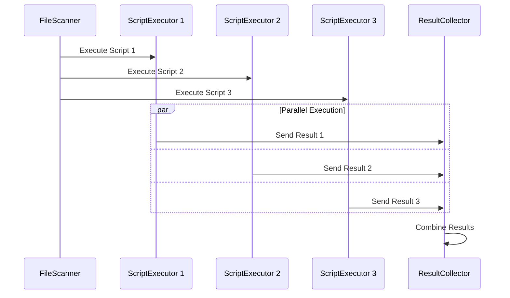

# Map Reduce - Educational File Based

This project is an educational example of Elixir/Erlang OTP usage, demonstrating a simplified "map-reduce" operation over files.

## Project Overview

The project will:

* Use one actor to transform an incoming message with {directory name, to whom to send filenames} and then send all paths of filenames (scripts) inside this directory to another specified actor.
* Launch other actors in parallel (with a configurable limit), executing all those files with bash, and once completed, sending results to a third actor.
* Have a third actor receive all those results, combining them together into one log file, writing `# YYYY-DD-MM HH:MM:ss scriptname` followed by results enclosed in ````````` , ````````` (nine backticks as opening and ending).

## Project Architecture

The project is structured using Elixir's OTP (Open Telecom Platform) principles, specifically utilizing GenServers for concurrent processing. It consists of three main components:

1. **FileScanner**: Responsible for scanning a directory and sending file paths to the ScriptExecutor.
2. **ScriptExecutor**: Executes bash scripts and sends results to the ResultCollector.
3. **ResultCollector**: Collects and formats results from executed scripts.

## How It Works

1. The FileScanner receives a directory path.
2. It scans the directory for files and sends each file path to the ScriptExecutor through a worker pool.
3. The ScriptExecutor runs each file as a bash script in parallel, respecting the maximum number of workers.
4. Results from each script execution are sent to the ResultCollector.
5. The ResultCollector formats and stores the results.
6. Finally, all results are combined into a single output file.

## Educational Introduction

This project serves as an introduction to implementing the map-reduce pattern in Elixir/Erlang. Map-reduce is a programming model for processing and generating large data sets with a parallel, distributed algorithm on a cluster.

In our simplified example:
- The "map" phase is represented by the ScriptExecutor, which processes each file independently.
- The "reduce" phase is handled by the ResultCollector, which combines the results.

This implementation showcases several key concepts in Elixir/Erlang:
- Concurrent processing using GenServers
- Message passing between processes
- Supervision trees for fault tolerance
- File I/O operations

## Code Walkthrough

### Entry Point

The entry point of the application is in `lib/map_reduce.ex`. This module defines the application callback and sets up the supervision tree.

```elixir
defmodule MapReduce do
  use Application

  def start(_type, _args) do
    children = [
      {MapReduce.FileScanner, []},
      {MapReduce.ScriptExecutor, []},
      {MapReduce.ResultCollector, []}
    ]

    opts = [strategy: :one_for_one, name: MapReduce.Supervisor]
    Supervisor.start_link(children, opts)
  end
end
```

### FileScanner

The FileScanner (`lib/map_reduce/file_scanner.ex`) is responsible for scanning a directory and sending file paths to the ScriptExecutor.

```elixir
def handle_call({:scan, directory}, _from, state) do
  files = File.ls!(directory)
  |> Enum.filter(&File.regular?("#{directory}/#{&1}"))
  |> Enum.map(&"#{directory}/#{&1}")

  Enum.each(files, fn file ->
    GenServer.cast(MapReduce.ScriptExecutor, {:execute, file})
  end)

  {:reply, :ok, state}
end
```

### ScriptExecutor

The ScriptExecutor (`lib/map_reduce/script_executor.ex`) executes bash scripts and sends results to the ResultCollector.

```elixir
def handle_cast({:execute, file}, state) do
  result = System.cmd("bash", [file])
  GenServer.cast(MapReduce.ResultCollector, {:collect, file, result})
  {:noreply, state}
end
```

### ResultCollector

The ResultCollector (`lib/map_reduce/result_collector.ex`) collects and formats results from executed scripts.

```elixir
def handle_cast({:collect, file, result}, state) do
  timestamp = NaiveDateTime.local_now() |> NaiveDateTime.to_string()
  formatted_result = "# #{timestamp} #{file}\n`````````\n#{result}\n`````````\n\n"
  updated_results = [formatted_result | state.results]
  {:noreply, %{state | results: updated_results}}
end
```

## Design Decisions

1. **Use of GenServers**: GenServers are used to manage state and handle concurrent operations efficiently.
2. **Message Passing**: Asynchronous message passing (using `cast`) is used for non-blocking operations.
3. **Supervision Tree**: A supervision tree is implemented for fault tolerance and proper process management.
4. **File I/O**: File operations are performed using Elixir's built-in `File` module.

## Running the Project

### From Command Line

1. Build the project:
   ```
   make build
   ```

2. Run the project:
   ```
   make run
   ```

### In Elixir's Interactive Shell (IEx)

1. Start the interactive shell:
   ```
   iex -S mix
   ```

2. Start the application:
   ```elixir
   MapReduce.start(:normal, [])
   ```

3. Scan a directory:
   ```elixir
   GenServer.call(MapReduce.FileScanner, {:scan, "scripts"})
   ```

4. Get results:
   ```elixir
   GenServer.call(MapReduce.ResultCollector, :get_results)
   ```

### Useful IEx Commands

- List all running processes:
  ```elixir
  Process.list()
  ```

- Get info about a specific process:
  ```elixir
  Process.info(pid)
  ```

- Stop a specific process:
  ```elixir
  Process.exit(pid, :normal)
  ```

- Stop the application:
  ```elixir
  Application.stop(:map_reduce)
  ```

This project provides a practical, hands-on approach to learning about concurrent processing and the map-reduce pattern in Elixir/Erlang. By exploring the code and running the examples, you'll gain valuable insights into building distributed systems with OTP.
# MapReduce System Diagrams

## Data Flow Diagram



## Parallel Processing Diagram



These diagrams illustrate the MapReduce system's data flow and parallel processing capabilities:

1. The Data Flow Diagram shows how file paths are distributed from the FileScanner to multiple ScriptExecutor instances, and how the results are then collected by the ResultCollector before being written to the output file.

2. The Parallel Processing Diagram demonstrates how multiple ScriptExecutor instances can process scripts concurrently, sending their results to the ResultCollector asynchronously.

The use of multiple ScriptExecutor instances (1, 2, and 3) in both diagrams represents the system's ability to parallelize the execution of scripts, which is a key feature of the MapReduce pattern.
