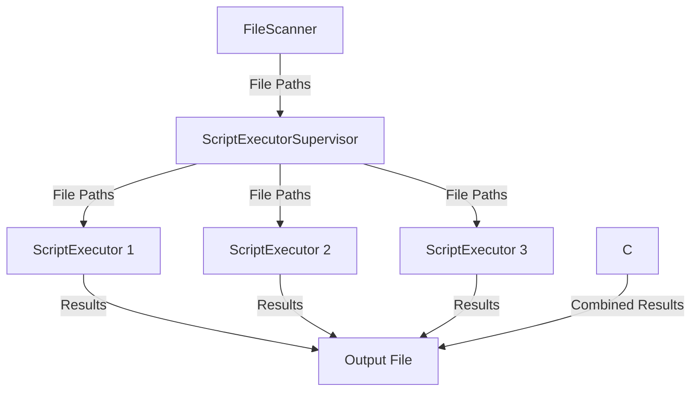
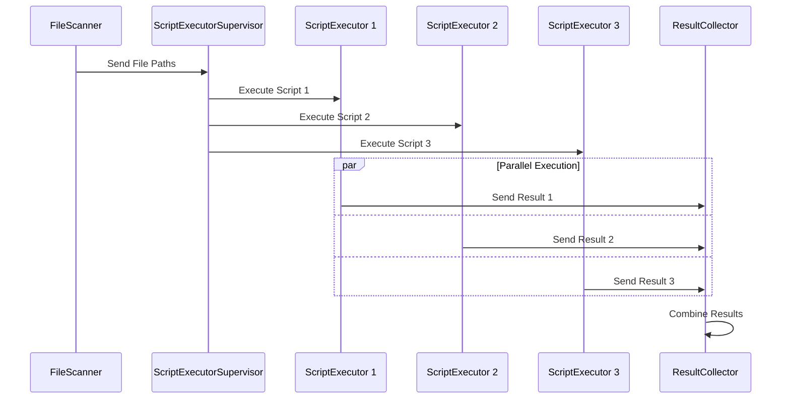

# MapReduce System Diagrams

## Data Flow Diagram

## Parallel Processing Diagram

These diagrams illustrate the MapReduce system's data flow and parallel processing capabilities:

1. The Data Flow Diagram shows how file paths are distributed from the FileScanner to multiple ScriptExecutor instances, and how the results are then collected by the ResultCollector before being written to the output file.

2. The Parallel Processing Diagram demonstrates how multiple ScriptExecutor instances can process scripts concurrently, sending their results to the ResultCollector asynchronously.

The use of multiple ScriptExecutor instances (1, 2, and 3) in both diagrams represents the system's ability to parallelize the execution of scripts, which is a key feature of the MapReduce pattern.
